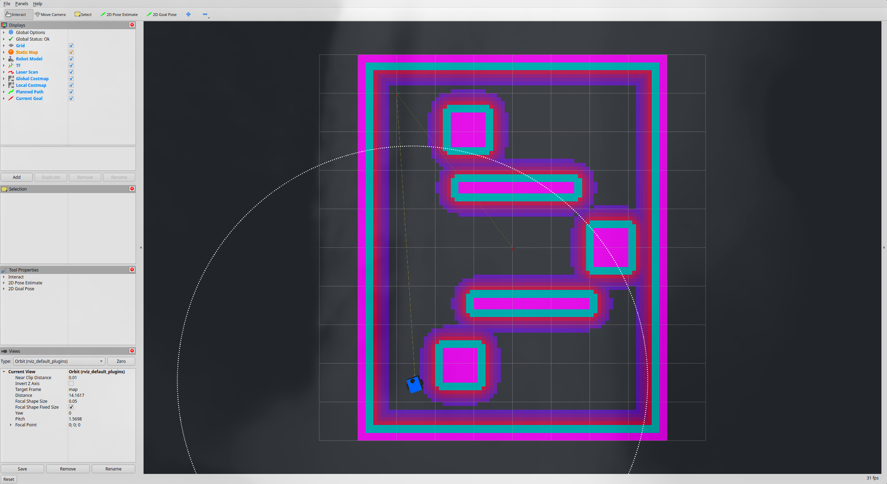
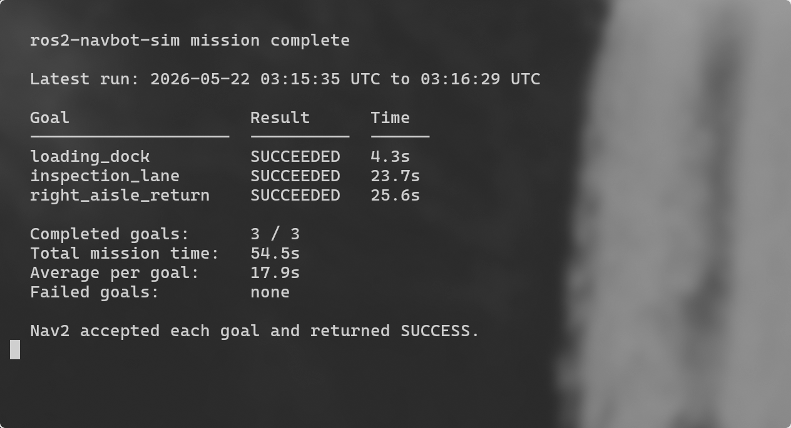
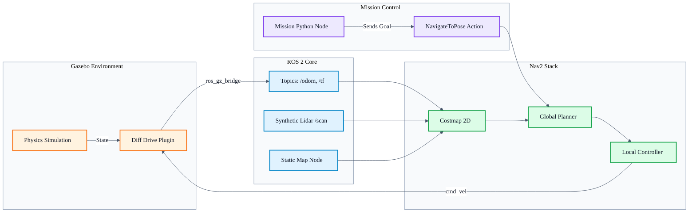

# ROS 2 NavBot Simulation


This is a ROS 2 Jazzy simulation where a differential-drive robot navigates a warehouse environment using Gazebo Harmonic, RViz2, and Nav2.

Built this to show a working robotics stack without hiding the tradeoffs. The project uses a custom diff-drive robot, a static warehouse map, Nav2 planning/control, and a Python mission node that sends goals and logs the run.

---

## Demonstration

### Autonomous Navigation
The robot executes a multi-goal mission across the warehouse floor.


### RViz Planning View
RViz shows the static map, robot model, laser scan, costmaps, active goal, and planned path.



### Mission Execution Logging
Terminal output showing the successful execution and logging of a sequence of goals.



---

## What This Demonstrates

I designed this project to show how the main pieces of a ROS 2 navigation stack fit together:

- **ROS 2 Package Architecture**: Separated the logic into distinct packages (`bringup`, `description`, `mission`) using colcon build patterns.
- **Simulation Integration**: Uses Gazebo Harmonic (modern Gazebo) and connects to ROS via `ros_gz_sim` and `ros_gz_bridge`.
- **Differential Drive Kinematics**: The robot uses custom URDF and SDF models instead of depending on TurtleBot3 simulator packages.
- **Nav2 Stack**: The navigation is fully configured using a static map, layered costmaps, global planning (NavFn), and local control (DWB).
- **Mission Control**: A Python mission node uses the Nav2 `NavigateToPose` action to send goals and log mission performance.

---

## Tech Stack & Engineering Decisions

### Core Technologies
- **OS**: Ubuntu 24.04
- **Middleware**: ROS 2 Jazzy
- **Simulation**: Gazebo Harmonic
- **Navigation**: Nav2 stack
- **Visualization**: RViz2
- **Language**: Python 3 / Bash / C++ (via ROS 2 binaries)

### Engineering Decisions
1. **Custom Robot Definition**: The robot lives in `navbot_description`, with matching URDF for RViz and SDF for Gazebo.
2. **Static Mapping**: The demo uses a static map with a fixed `map -> odom` transform. That keeps the run repeatable and keeps the focus on planning/control rather than SLAM.
3. **Selectable Laser Source**: By default, a synthetic `/scan` publisher keeps the demo stable in containerized or GPU-sensitive environments. Native Ubuntu users can switch to the Gazebo lidar path with `use_synthetic_scan:=false`.

---

## System Architecture

Gazebo runs the physics engine and broadcasts odometry and TF data through the ROS bridge. Nav2 takes this data, along with the static map, to generate the velocity commands (`/cmd_vel`) that drive the robot.



---

## Repository Layout

```text
ros2-navbot-sim/
├── docs/                      # Screenshots, gifs, and architectural documentation
├── scripts/                   # Bash utilities for setup and execution
└── src/
    ├── navbot_bringup/        # High-level launch files, Nav2 config, maps, and Gazebo worlds
    ├── navbot_description/    # Robot URDF, SDF, meshes, and kinematic models
    └── navbot_mission/        # Python ROS 2 nodes for mission orchestration and metrics logging
```

---

## Quick Start

### 1. Environment Setup

Run this on **Ubuntu 24.04** with the ROS 2 Jazzy apt repository configured:

```bash
cd ros2-navbot-sim
./scripts/setup_ubuntu_24_04.sh
```
*Note: If ROS 2 Jazzy isn't installed yet, install it first, then run this setup script to fetch the dependencies and build the workspace.*

### 2. Launch the Demo

You can launch Gazebo, RViz, the ROS bridges, Nav2, and the custom mission node with a single command:

```bash
cd ros2-navbot-sim
./scripts/run_demo.sh
```

Useful launch options:

```bash
# Run without the Gazebo GUI. Handy on Wayland/NVIDIA setups where Gazebo renders black.
./scripts/run_demo.sh gui:=false

# Try Gazebo's lidar sensor instead of the default synthetic scan publisher.
./scripts/run_demo.sh use_synthetic_scan:=false

# Launch RViz/Nav2 only, without starting the mission automatically.
./scripts/run_demo.sh start_mission:=false
```

### 3. Observe the Output

Once everything is up, the mission node will output the progress of the multi-goal navigation directly to the terminal. You should see logs like this:

```text
[multi_goal_nav] Waiting for bt_navigator lifecycle state ACTIVE...
[multi_goal_nav] Goal 1/3 loading_dock: x=3.35 y=-2.70 yaw=0.00
[multi_goal_nav] Goal loading_dock status: distance_remaining=3.21m navigation_time=5.2s recoveries=0
[multi_goal_nav] Goal loading_dock succeeded in 29.6s
...
[multi_goal_nav] Mission complete: 3/3 goals reached in 105.4s
[multi_goal_nav] Wrote mission log: logs/mission_2026-05-22T10-42-10.json
```

## More Notes

- [Architecture notes](docs/architecture.md)
- [Engineering notes](docs/engineering_notes.md)
- [Troubleshooting](docs/troubleshooting.md)
